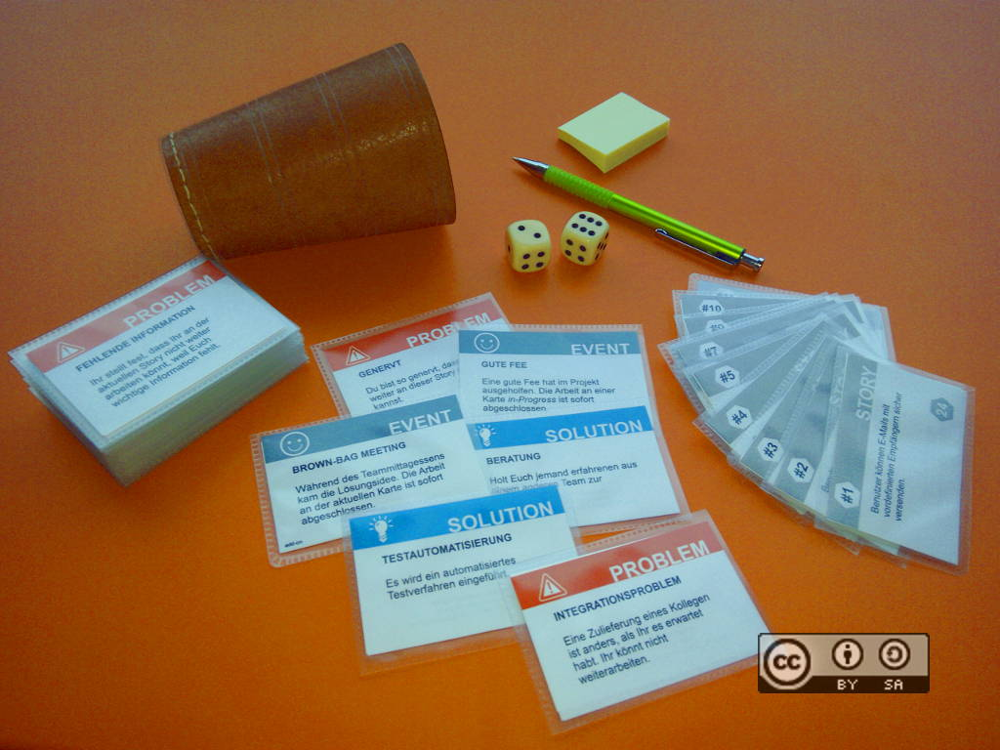

# Scrum-Card-Game

Scrum Card Game: Scrum Sprint Simulation played as a multi-player card game

<table><tbody>
<tr><td></td><td>The main game material of Scrum Card Game,<br /><a rel='license' href='http://creativecommons.org/licenses/by-sa/4.0'></a>This image is licensed under a <a rel='license' href='http://creativecommons.org/licenses/by-sa/4.0'>Creative Commons Attribution-ShareAlike 4.0 International License</a>.</td></tr>
</tbody></table>

## Print and Play

This repository's subdirectories contain PDF files with rules and
cards to print and play the game. Different variants of card
sizes are available. To make the cards durable you could laminate
the cards.

* <a href='https://github.com/OMerkel/Scrum-Card-Game/releases'>Get the latest release in English or German!</a>
* Additionally the repository's root holds subdirectories with names reflecting which card size related files can be found in there.

The card designs of the Scrum Card Game are available in PDF and SVG. If you can get blank business cards
available as office supplies then you can print the PDF onto the blank cards.
Another option is to print the cards on normal paper and then cut the cards manually. Heavy
weight paper shall be used for enhanced durability. For better protection the cards could be laminated.
The lamination foil should be non glare if possible and available. In case you plan to create own card
texts or modify the existing ones you should go for an alternative approach like putting the cards into
business card pouches for single cards. The cards are kept in the protecting pouches while playing and
the cards can be easily removed from the pouch as intended, be modified and placed back.

Using card size of standard business cards (85mm x 54mm) will allow to use business card pouches
for card protection. To ease printing and finishing of cards a business card size of
85mm x 54mm is chosen in files of directory named '85x54mm-business card size'.

Instead of searching for business card pouches in office supplies
you could find similar articles in game stores stocking Trading Card
Games (TCGs). TCG players often protect their cards with card
sleeves or card protectors. The ones that match the business cards
in size are called Standard American Board Game Sleeves
(87mm x 56mm, 3-1/2 x 2-1/4 inch).

More common and popular for TCGs is a so called Standard Card Size
(88mm x 63mm, 3-1/2 x 2-1/2 inch) with sleeve protectors a bit
bigger than that (91mm x 66mm). In case you can get these in different
variants then non glare sleeves are recommended.

## How to...

In case you want to generate components like rules text or the cards separately or on your own.

### Generate the Rules as PDF

Rules are maintained in [Docbook](http://docbook.org) format.
Related files can be found in `Scrum-Card-Game/scrum_card_game-rules/docbook/src/docbkx` .
The simplest way to generate the PDFs from Docbook using this repository is to install and use [Maven](https://maven.apache.org).

Invocation to generate the PDFs from Docbook looks like

```
cd scrum_card_game-rules/docbook
mvn docbkx:generate-pdf
```

### Generate the Playing Cards

To just generate the cards with already existing card defintions [Python](https://www.python.org) is needed.

```
cd cardgenerator
python cardgenerator.py
```

The cards get generated in the same directory as [SVG](https://www.w3.org/Graphics/SVG)
(Scalable Vector Graphics, W3C standard).

### Modify the Playing Cards

Cards are maintained in [Python](https://www.python.org) files. Python script files are separated
from files that hold the card descriptions. Although the card description files are simple
Python files, too. This is to not mix data with scripts.

The card descriptions can be found in `cardgenerator/cardcontent.py` covering all languages.
The syntax follows Python [JSON](http://json.org) (JavaScript Object Notation,
ECMA-404 The JSON Data Interchange Standard) format.

Card types supported by the `cardgenerator.py` are

1. 'type' : 'story'
2. 'type' : 'event'
3. 'type' : 'solution'
4. 'type' : 'problem'

Event cards describe positive, neutral, or negative impact on the game result by smilies.
Smilies supported by the `cardgenerator.py` are

1. 'smiley' : ':-)'
2. 'smiley' : ':-|'
3. 'smiley' : ':-('

Titles and text fields should stay at a reasonable text length.

### Concatenate PDFs into one PDF if needed

A possible cover page can be found as `scrum_card_game-rules/scrum_card_game-cover.pdf`

SVGs can be converted to PDF or PS (Postscript) in various ways and with various tools.

In case you insist to have rules and cards in a single combined PDF file a free tool
like [GhostScript](http://ghostscript.com) could be used.

Concatenating multiple PDFs into a combined one could be achieved as follows

```
gs -dBATCH -dNOPAUSE -q -sDEVICE=pdfwrite -sOutputFile=scrum_card_game-104x69mm-en.pdf scrum_card_game-cover.pdf scrum_card_game-rules-en.pdf scrum_card_game-104x69mm-en-0_svg.pdf scrum_card_game-104x69mm-en-1_svg.pdf...
```

Here the PDFs `scrum_card_game-cover.pdf scrum_card_game-rules-en.pdf scrum_card_game-104x69mm-en-0_svg.pdf scrum_card_game-104x69mm-en-1_svg.pdf...` get concatenated into `scrum_card_game-104x69mm-en.pdf`.

Windows users might find GhostScript versions in 32bit and 64bit as `gswin32.exe` and `gswin64.exe` with similar command line arguments in place.

## Links

* http://scrumcardgame.com/scrum-card-game-rules
* http://docbook.org
* https://maven.apache.org
* https://www.python.org
* http://json.org
* https://www.w3.org/Graphics/SVG
* http://ghostscript.com

## Legal / License

<a rel='license' href='http://creativecommons.org/licenses/by-sa/4.0'></a><br />This work is licensed under a <a rel='license' href='http://creativecommons.org/licenses/by-sa/4.0'>Creative Commons Attribution-ShareAlike 4.0 International License</a>.

_All logos, brands, and trademarks mentioned belong to their respective owners._
